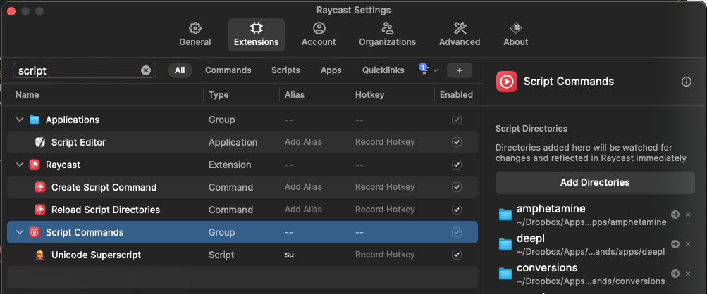
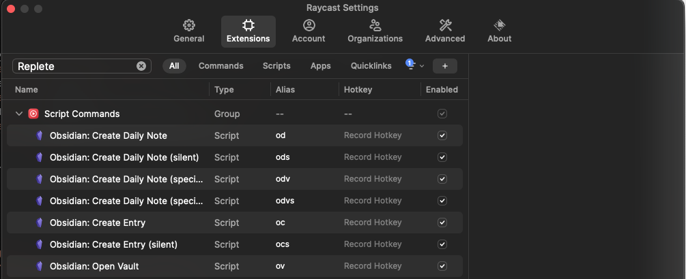

# Replete Raycast Script Commands

This repository contains some handy Raycast script commands. I'll add more as I migrate over

## Installation

1) Copy this repository locally
    * [Download a zip file](https://github.com/replete/raycast-script-commands/archive/refs/heads/main.zip) or
    `git clone git@github.com:replete/raycast-script-commands.git`
2) Add the new script commands directory to RayCast
    * Activate Raycast, open `Extensions`
    * Search for and select `Script Commands`
    * Click `Add Directories` then select this folder
    
3) Add aliases for each script
    * In Raycast, search Extensions for `Replete`
    * Disable scripts you don't want to use
    * Enter aliases for the script commands you want to use
    
4) Edit variables inside `config.sh` accordingly

## Script Commands

### Obsidian

Uses Obsidian's URI schema, so Obsidian will open each time.
If file already exists, entry text is appended after a new line.

* **Obsidian: Open Vault** `ov vaultname`
* **Obsidian: Create Entry** `oc` `vaultname`  `entry text (optional)` `title text (optional)` 
* **Obsidian: Create Daily Note** `od` `entry text`
* **Obsidian: Create Daily Note in Vault** `odv` `vaultname` `entry text (optional)`

### OBS

Remote control of OBS via websockets.
Configure in `config.sh`

* **OBS: Switch Scene** `obss` `scene name`